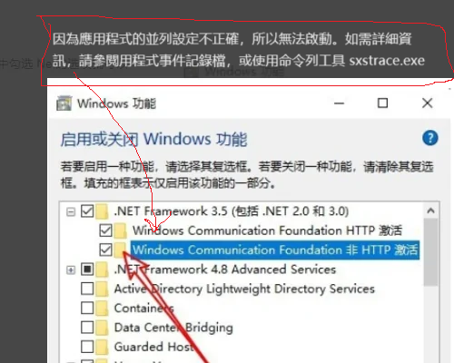

# LangResorceMgr.exe 操作與其他說明


## 无法启动此应用程序

https://learn.microsoft.com/zh-cn/dotnet/framework/install/application-not-started

在运行 .NET Framework 应用程序时出现“无法启动此应用程序”错误


## 为什么. net服务无法开始

因為應用程式的並列設定不正確，所以無法啟動。如需詳細資訊，請參閱用程式事件記錄檔，或使用命令列工具 sxstrace.exe

修復 :https://zhidao.baidu.com/question/1314020757569669859.html



## LangResorceMgr.exe.config配置

```
<?xml version="1.0" encoding="utf-8" ?>
<configuration>
    <startup> 
        <supportedRuntime version="v4.0" sku=".NETFramework,Version=v4.6" />
    </startup>
    <connectionStrings>
      <!--數據庫連接串-->
      <add name="IShopDBContext" connectionString="data source=81.71.74.135;initial catalog=IshopX559;persist security info=False;user id=admin;password=admin123;MultipleActiveResultSets=True;App=EntityFramework" providerName="System.Data.SqlClient" providerName="System.Data.SqlClient" /> 
    </connectionStrings>
    <appSettings>
      <!--生成cs文件资源路径-->
      <add key="targetFileName" value="D:\ClientIshop_Ishop_AD\IshopX_GitHub\IshopX\LanguageResource\LangPublic.cs" /> 
    </appSettings>
</configuration>
```

