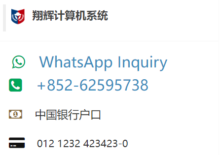
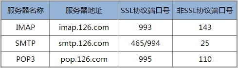
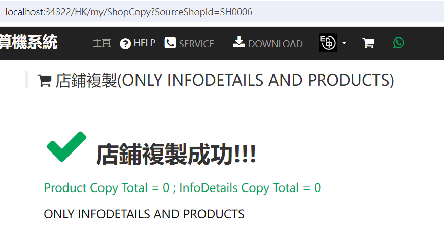
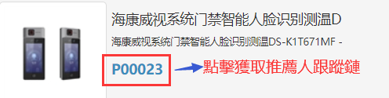

# 開發日誌

**IshopX --- At the Heart of your Ecosystem!**

## 框架:

使用 .NET Framework 4.8 ，C# 語言的版本通常是 C# 7.3。 後續可以升級待進一步研究.

------

## 角色:

| RoleName ID            | Description                       | Remarks |
| ---------------------- | --------------------------------- | ------- |
| Supervisor             | 超级管理员、监督、全局管理员、CEO |         |
| Admins                 | 管理員（Global）                  |         |
| StoreAdmin             | 店長、店家營運主管                |         |
| StoreProductAdmin      | 產品管理                          |         |
| StorePreSales          | 店舖售前客服 跟單                 |         |
| CustomerService        | 客戶售後服務,處理抱怨等等         |         |
| AdminAnalyst           | 數據分析員                        |         |
| StoreCustomersService  | 店舖售後                          |         |
| StoreBusinessPromotion | 店內商業推廣等                    |         |
| StroeShippingClerk     | 店舖出貨員                        | 倉管    |
| BusinessPromotion      | 業務推廣,網站編輯,批量馬甲維護等  |         |
| GlobalUser             | 網站使用者(註冊用戶)              |         |

## 店鋪模版須知

如果沒有對應的店鋪模版,則導致相應店鋪的嚴重錯誤.例如:

Shared\ShopFootTemplate\sh0006_FooterTemplate.cshtml

Shared\ShopFootTemplate\SH2028_FooterTemplate.cshtml

Shared\ShopViewTemplate1\sh0006_zh-HK.cshtml

類似這樣格式的,在Shared文件夾下的,需以此規則排查

## 增加TemplateC/IndexC

 RadioEngin [TemplateC] 主要的模版文件在 Shared/TemplateC

共有三個模版,由 Shop.InfoMode控制, 更改-> ShopUdate->InfoMode

1.  IndexA.cshtml 模版  Shared/TemplateA
2.  IndexB.cshtml 模版  Shared/TemplateB
3.  IndexC.cshtml 模版  Shared/TemplateC

## 增加HEADER模版

```
模版文件在 Shared/ShopHeaderTemplate 使各個店鋪自己風格定義HEADER
ShopHeaderTemplate/sh0001_LayOutHeader.en-US.cshtml
ShopHeaderTemplate/sh0001_LayOutHeader.zh-CN.cshtml
ShopHeaderTemplate/sh0001_LayOutHeader.zh-HK.cshtml
```

## 銀行與WhatsApp(Wechat) 信息

此模版位於 infodetails頁面和P 產品明細頁面



Shared\Info\ViewIsInfoMode.cshtml 控制傳入Shop對象,如果簡體版本,可以針對語言版本具體改動上述內容:

相應的模版

```
Shared\ShopViewTemplate1\sh0006_en-US.cshtml (海外或香港信用卡支付方式等等)
Shared\ShopViewTemplate1\sh0006_zh-CN.cshtml (效果支付方式)
Shared\ShopViewTemplate1\sh0006_zh-HK.cshtml (國內支付方式)
其他店鋪相應更改ShopId
三個模版可以根據具體情況而改變模版內容就可以.
```


## 主頁的AI-BOX 的專題廣告

2024-4-25 增加AI-BOX 的主頁的專題廣告以及產品功能說明,繁簡英三個版本

```
Shared/TemplateB/SoftwareMainFuncAiBoxENUS.cshtml
Shared/TemplateB/SoftwareMainFuncAiBoxENUS.cshtml
Shared/TemplateB/SoftwareMainFuncAiBoxENUS.cshtml
Shared/TemplateB/AdMainAiBox.en-US.cshtml
Shared/TemplateB/AdMainAiBox.zh-CN.cshtml
Shared/TemplateB/AdMainAiBox.zh-HK.cshtml
/Content/Images/AdMainAiBox_SloganP1.png(jpg)
/upload/AIBOX/OrangePIdemo_ Crop0409.mp4
```

## 主頁參數

Index(string id,string InfoCateID ,string Index2,string code,string state)

參考:


## 計劃GOOGLE/BAIDU/FB 廣告頁面

增加一個靜態html廣告頁面,專門FOR GOOGLE/BAIDU/FB 廣告頁面

## 店鋪ID的規則

默認店鋪在 /Context/WebSiteCookie.cs  line : 348
規則 如果從uri請求在數據庫無法查詢到對應的域名 則使用默認值 ShopId ="sh0006"

**測試的店鋪和對應的ID** 

```
██ C:\Windows\System32\drivers\etc\host 系統文件,配置域名和 IP 地址的映射
127.0.0.1 sunwaylink.com 		# sh0001 login Id:Supervisor@xyz.com 
127.0.0.1 xguard.cn 			# sh0006 login Id:joyercomcn@qq.com
127.0.0.1 dataguardxcore.com X 	# sh0016 not exist lawtatfaitony@gmail.com
127.0.0.1 dataguard.com 		# SH2028 no download login Id:lawtatfaitony@gmail.com
127.0.0.1 dataguardxcore.com 	# SH2028 login Id:lawtatfaitony@gmail.com			
```

##  創建店鋪:

http://81.71.74.135:8081/hk/manage/Createshop  

**3 options: zh-HK; zh-CN; en-US;**  三種貨幣的選擇,對應是: $HK ; ¥RMB ;$US;

## 目前的店鋪

| sh0001  | 三个小        | 620000 | Super..or@xyz.com     | zh-CN | sunwaylink.com     | 0    |
| ------- | :------------ | ------ | --------------------- | ----- | ------------------ | ---- |
| sh0006  | 翔輝          | 620002 | joye..cn@qq.com       | zh-HK | xguard.cn          | 1    |
| ▲SH2006 | HK CCTV LTD.  | 620021 | cai..li82@gmail.com   | zh-CN | dataguardxcore.com | 1    |
| SH2028  | STAT BILL..T  | 620028 | law..fai..y@gmail.com | zh-HK | dataguard.com      | 0    |
| SH0012  | xxx計算機系統 |        | essolf...on@qq.com    | zh-HK | pawd: adxxxxx8     | 1    |

```
sh0006  翔輝系統
考勤薪酬、安防业务：
http://81.71.74.135:8081/?ShpID=sh0006 
sh0016 
http://81.71.74.135:8081/?ShpID=sh0016
薪酬与考勤系统 、安防业务： starbilliant.cn
SH2028
http://81.71.74.135:8081/?ShpID=SH2028
安防业务 dataguard.com
上述以 [/?ShpID=sh0016]傳入,已經作廢,由於受到規則 WebCookie.ShpID 通過HostName判斷店鋪ID,導致 ID傳入主頁有用,其餘都作廢了.
```

██ **創建店鋪後,必須由系統管理員授權後才能跳轉到後台**

###  Cookie: ShpId 與 ShopID區別

1. WebCookie.ShpId     前端店鋪的Shop ID
2. WebCookie.ShopID  後端店鋪的Shop ID

++++++++++++++++++++++++++++++++++++++++++++


## 丟失引用文件/shop/bin 

導致編譯不通過的情況是由於

 從這裡複製 Ishop\backup_dll_annotationExtensions_and_clientvalid

 不再引用項目,太久遠,保留源碼獨立輸出

1.  DataAnnotationsExtensions.dll
2.  DataAnnotationsExtensions.ClientValidation.dll

## SMS發送

由於個別平台限制上存敏感資料.accesskey 等保存在Web.config

文件 App_Start\IdentityConfig.cs  如何获得accesskey  ：https://ak-console.aliyun.com/#/accesskey
line 112 : IClientProfile profile = DefaultProfile.GetProfile("xxx", "xxx", "xxx");  //裡面的參數值xxx是虛假的

### 國際短信驗證平台

https://www.cm.com/zh-cn/pricing/


## 如何表達店鋪貨幣:

```
@mvcCommeBase.GetShopPriceByShopCurrency(string.Format("{0:f1}", Model.TradePrice), (string)ViewBag.ShopCurrency)  
// ViewBag.ShopCurrency 由初始化函數 From: BaseController.ShopInitialize()
```

## 郵件系統:

默認標準端口如:



​				    這個只是一個標準而普遍使用的端口.

## 設置允許第三方 cookie

在 C# .NET 中，要設置允許第三方 cookie，可以通過在 HTTP 響應標頭中添加 `SameSite=None; Secure` 來實現。這樣可以告訴瀏覽器允許第三方 cookie。

以下是一個示例代碼：

```csharp
Response.Cookies.Append("cookieName", "cookieValue", new CookieOptions
{
    Secure = true,
    SameSite = SameSiteMode.None
});
```

通過上面的代碼，你可以在 C# .NET 中設置一個允許第三方 cookie 的 cookie。請確保在使用這個功能時遵循相關的安全最佳實踐。

## 訂單與購物車功能須知:

必須先增加SKU才能選擇交易屬性實現加入購物車功能,如果無法創建SKU,那肯定是類目,屬性,屬性值沒有設置導致的.必須按流程 : 類目,屬性,屬性 > 產品 > SKU > 購物車 > 訂單 > 發貨單 > 支付

## 取消手幾號碼登錄

對個人經營的情況下,管理太多資源導致精力有效.

Views/Account/MobileRegister.cshtml

## login重定向問題

**代碼如下:**

```
[HttpPost]
[AllowAnonymous] 
public async Task<ActionResult> Login(LoginViewModel model, string returnUrl)
{
   ....
   //重定向登錄到 returnUrl
    if (!string.IsNullOrEmpty(returnUrl))  //改為這樣,登錄/Redirect沒問題
    {
        return RedirectToLocal(returnUrl);
    }
    else
    {
        return RedirectToAction("Index", "Home",
        			new { Language = ViewBag.LanguageCode}); //case: no returnUrl 
    }
   ....
}
```

## 店鋪複製

把另一個店鋪的Infodetail表和Product表的內容複製到自己店鋪.

**目的:避免重複手工錄入.**

注意:這是一個批量處理,具體的SKU和庫存等等還需要重新到後台設置一下才能有效的,特別對購物流程,必須要手動設置SKU.

回復/還原 : 為了避免誤操作,在 字段 product.OperatedDate = new DateTime(2000,01,01,01,01,01,01); 作為批量處理的標識,配合CreateDate = now ,可以在數據庫mssql studio IDE 工具,批量刪除掉

恢復的關鍵字規則:

```
OperatedDate = new DateTime(2000, 01, 01, 01, 01, 01, 01),
CreatedDate = new DateTime(dt.Year, dt.Month, dt.Day, dt.Hour, dt.Minute, 01, 01),
```

具體操作:

```
打開鏈接 : 
http://localhost:34322/HK/my/ShopCopy?sourceShopId=sh0006&targetShopId=SH0012  
http://81.71.74.135:8081/HK/my/ShopCopy?SourceShopId=sh0006&TargetShopId=SH0012
sh0006是複製來源店鋪的店鋪ID 
SH00054是目標店鋪的店鋪ID 
檢查目標是否存在 : http://81.71.74.135:8081/hk/manage/Createshop 
```

這樣,直到返回結果就算是複製成功.

 

## 推薦人跟蹤鏈接

http://localhost:34322/zh-HK/Home/p/Tr001060

登錄後,從後台 http://localhost:34322/Mgr/ProductMgr 列表獲取推薦人鏈接


