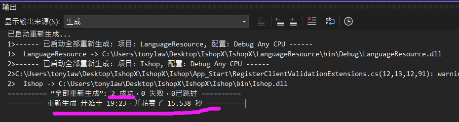

# 開發日誌

立项时间：2021年10月21日

ISHOP新版开发—2021年12月21日阶段性开发完毕.MD

ISHOP新版开发—2024年4月25日阶段性开发完毕.MD

## 店鋪模版須知

如果沒有對應的店鋪模版,則導致相應店鋪的嚴重錯誤.例如:

Shared\ShopFootTemplate\sh0006_FooterTemplate.cshtml

Shared\ShopFootTemplate\SH2028_FooterTemplate.cshtml

Shared\ShopViewTemplate1\sh0006_zh-HK.cshtml

類似這樣格式的,在Shared文件夾下的,需以此規則排查

## 主頁的AI-BOX 的專題廣告

2024-4-25 增加AI-BOX 的主頁的專題廣告以及產品功能說明,繁簡英三個版本

```
Shared/TemplateB/SoftwareMainFuncAiBoxENUS.cshtml
Shared/TemplateB/SoftwareMainFuncAiBoxENUS.cshtml
Shared/TemplateB/SoftwareMainFuncAiBoxENUS.cshtml
Shared/TemplateB/AdMainAiBox.en-US.cshtml
Shared/TemplateB/AdMainAiBox.zh-CN.cshtml
Shared/TemplateB/AdMainAiBox.zh-HK.cshtml
/Content/Images/AdMainAiBox_SloganP1.png(jpg)
/upload/AIBOX/OrangePIdemo_ Crop0409.mp4
```

## 主頁參數

Index(string id,string InfoCateID ,string Index2,string code,string state)

參考:


## 計劃GOOGLE/BAIDU/FB 廣告頁面

增加一個靜態html廣告頁面,專門FOR GOOGLE/BAIDU/FB 廣告頁面

## 店鋪ID的規則

默認店鋪在 /Context/WebSiteCookie.cs  line : 348
規則 如果從uri請求在數據庫無法查詢到對應的域名 則使用默認值 ShopId ="sh0006"

**測試的店鋪和對應的ID** 

```
C:\Windows\System32\drivers\etc\host 系統文件,配置域名和 IP 地址的映射
127.0.0.1 sunwaylink.com 		# sh0001
127.0.0.1 xguard.cn 			# sh0006
127.0.0.1 dataguardxcore.com 	# sh0016
127.0.0.1 dataguard.com 		# SH2028
127.0.0.1 starbilliant.cn 		# SH2028
```

 

## 目前的店鋪

| sh0001 | 三个小情人的爸爸           | /Upload/ShopLogo/Shplogo_20171101063317284.png |
| ------ | -------------------------- | ---------------------------------------------- |
| sh0006 | 翔輝計算機系統             | /Upload/ShopLogo/Shplogo_20180826132306638.png |
| SH2006 | HK安防  LTD.               | /Upload/ShopLogo/Shplogo_20180826132306638.png |
| SH2028 | STAT BILLIANT AI TECH LTD. | /Upload/ShopLogo/Shplogo_20180826132306638.png |

sh0006  翔輝系統
考勤薪酬、安防业务：
http://81.71.74.135:8081/?ShpID=sh0006 

sh0016 
http://81.71.74.135:8081/?ShpID=sh0016
薪酬与考勤系统 、安防业务： starbilliant.cn

SH2028
http://81.71.74.135:8081/?ShpID=SH2028
安防业务 dataguard.com

 **For 音響工程**

Template C Sample : 

1. https://www.mxcamera.com/  參考
2. https://shop.hivihk.com/products/jbl-mk08-karaoke-speaker 這個比較複雜大型

++++++++++++++++++++++++++++++++++++++++++++

Update in 2024-4-28

## 丟失引用文件/shop/bin 

導致編譯不通過的情況是由於

 從這裡複製 Ishop\backup_dll_annotationExtensions_and_clientvalid

 不再引用項目,太久遠,保留源碼獨立輸出

1.  DataAnnotationsExtensions.dll
2.  DataAnnotationsExtensions.ClientValidation.dll

## github限制

文件 App_Start\IdentityConfig.cs

//由於github限制 不能直接寫 三個參數 cn-hangzhou=====", "LTAIZtZo=====jbLbxadL========", "BWvGVZRo88cKoK===========QAu71RFusXNNsAM5"
line 112 : IClientProfile profile = DefaultProfile.GetProfile("xxx", "xxx", "xxx");  //裡面的參數值xxx是虛假的



最後生成記錄 2024-4-29

## 如何表達店鋪貨幣:

```
@mvcCommeBase.GetShopPriceByShopCurrency(string.Format("{0:f1}", Model.TradePrice), (string)ViewBag.ShopCurrency)  
// ViewBag.ShopCurrency 由初始化函數 From: BaseController.ShopInitialize()
```

## 郵件系統:

默認標準端口如:


​				    這個只是一個標準而普遍使用的端口.

## 設置允許第三方 cookie

在 C# .NET 中，要設置允許第三方 cookie，可以通過在 HTTP 響應標頭中添加 `SameSite=None; Secure` 來實現。這樣可以告訴瀏覽器允許第三方 cookie。

以下是一個示例代碼：

```csharp
Response.Cookies.Append("cookieName", "cookieValue", new CookieOptions
{
    Secure = true,
    SameSite = SameSiteMode.None
});
```

通過上面的代碼，你可以在 C# .NET 中設置一個允許第三方 cookie 的 cookie。請確保在使用這個功能時遵循相關的安全最佳實踐。
